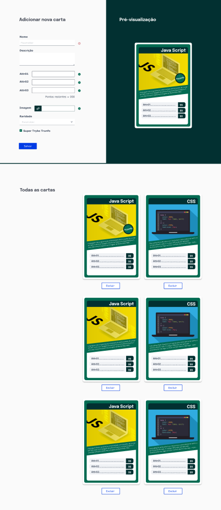
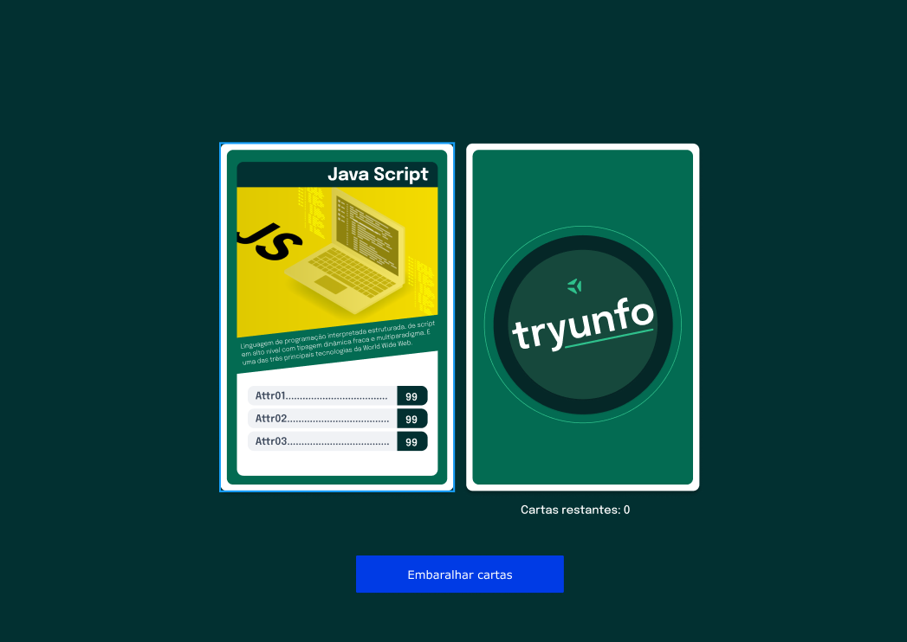

# Jogo-Carta-superTrunfo
<section>
Bem vindos(as) ao meu repositorio do projetinho de Front-end Tryunfo desenvolvido junto as aulas da Trybe.
</section>
 
<section>
  
<strong>👨‍💻 O que deverá ser desenvolvido</strong>
 

  Neste projeto foi desenvolvido um jogo no estilo Super Trunfo! Ao utilizar essa aplicação uma pessoa usuária deverá ser capaz de:

  * Criar um baralho com o tema livre;

  * Adicionar e remover uma carta do baralho;

  * Visualizar todas as cartas que foram adicionadas ao baralho;

  * Jogar com o baralho criado.

  ### Protótipo do projeto

  Você pode observar o protótipo nas imagens abaixo:

</section>
 

 

 
<section>
  
<strong>:memo: Habilidades testadas com esse projeto:</strong>
 

  Neste projeto, é testado habilidades de:

  * Ler o estado de um componente e usá-lo para alterar o que exibimos no browser

  * Inicializar um componente, dando a ele um estado pré-definido

  * Atualizar o estado de um componente

  * Capturar eventos utilizando a sintaxe do React

  * Criar formulários utilizando sintaxe JSX com as tags: `input`, `textarea`, `select`, `form`, `checkbox`

  * Transmitir informações de componentes filhos para componentes pais via callbacks
</section>
